# General Practice

## LeetCode #1: Two Sum

## LeetCode #2: Add Two Numbers

## LeetCode #3: Longest substring without repeating characters

<details>
  <summary>write-up</summary>

Given a string s, find the length of the longest
substring without repeating characters.

```
Example 1:
Input: s = "abcabcbb"
Output: 3
Explanation: The answer is "abc", with the length of 3.
```

```
Example 2:
Input: s = "bbbbb"
Output: 1
Explanation: The answer is "b", with the length of 1.
```

```
Example 3:
Input: s = "pwwkew"
Output: 3
Explanation: The answer is "wke", with the length of 3.
Notice that the answer must be a substring, "pwke" is a subsequence and not a substring.
```

#### Constraints:

0 <= s.length <= 5 \* 10^4

s consists of English letters, digits, symbols and spaces.

### a.k.a. Sliding Window

#### Explanation

The optimal solution is to use a hash set ... and a "sliding window".

##### Sliding Window

The idea is to have a sliding window.

So if the given string is "abcabcbb"

At first we will have a window of --> 'a' (_the window are the values currently stored in the set_)

Then we add 'b' --> 'ab'

Then we add 'c' --> 'abc'

Then we add 'a' --> 'abca'. When we reach the repeating 'a' character we remove the first duplicate 'a' (_from the left_), leaving us with 'bca'.

Then we add 'b' --> 'bcab', again remove repeats from the left side, leaving us with 'cab'

Then we add 'c' to the right --> 'cabc', and once again remove duplicates from the left, leaving us with 'abc'.

Now the interesting part, we will add the next 'b' giving us 'abcb', we need to remove characters from the left until we remove the duplicate. So first we remove 'a' --> bcb, then 'b' --> 'cb'. Leaving us with 'cb'.

Then we add the next 'b' --> 'cbb', once again start removing letters from the left until we remove the duplicate so 'cbb' becomes --> 'bb' --> 'b'.

So in the end we are left with only 'b' in the set.

But we should have been keeping track of the longest substring for each pass. which was 'abc' --> length of 3.

##### Step-by-step

Given: 'abcabcbb'

Start: ''

Step 1: '' add 'a' --> 'a'

Step 2: 'a' add 'b' --> 'ab'

Step 3: 'ab' add 'c' --> 'abc'

Step 4: 'abc' add 'a' --> 'abca' remove up to duplicate 'a' --> 'bca'

Step 5: 'bca' add 'b' --> 'bcab' remove up to duplicate 'b' --> 'cab'

Step 6: 'cab' add 'c' --> 'cabc' remove up to duplicate 'c' --> 'abc'

Step 7: 'abc' add 'b' --> 'abcb' remove up to duplicate 'b' --> 'cb'

Step 8: 'cb' add 'b' --> 'cbb' remove up to duplicate 'b' --> 'b'

##### C#

```
    public class OptimalSolution
    {
        public int LengthOfLongestSubstring(string s)
        {
            var charSet = new HashSet<char>();
            int left = 0, maxLength = 0;

            for (int right = 0; right < s.Length; right++)
            {
                while (charSet.Contains(s[right]))
                {
                    charSet.Remove(s[left++]);
                }

                charSet.Add(s[right]);
                maxLength = Math.Max(maxLength, right - left + 1);
            }

            return maxLength;
        }
    }
```

##### Python

```
class Solution:
  def lengthOfLongestSubstring(self, s: str) -> int:
    charSet = set()
    l = 0
    res = 0

    for r in range(len(s)):
      while s[r] in charSet:
        charSet.remove(s[l])
        l += 1
      charSet.add(s[r])
      res = max(res, r - l + 1)
    return res
```

</details>

# Daily Challenges

## LeetCode 2200: Find All K-Distant Indices in an Array

<details>
<summary>#2200</summary>

### Overview

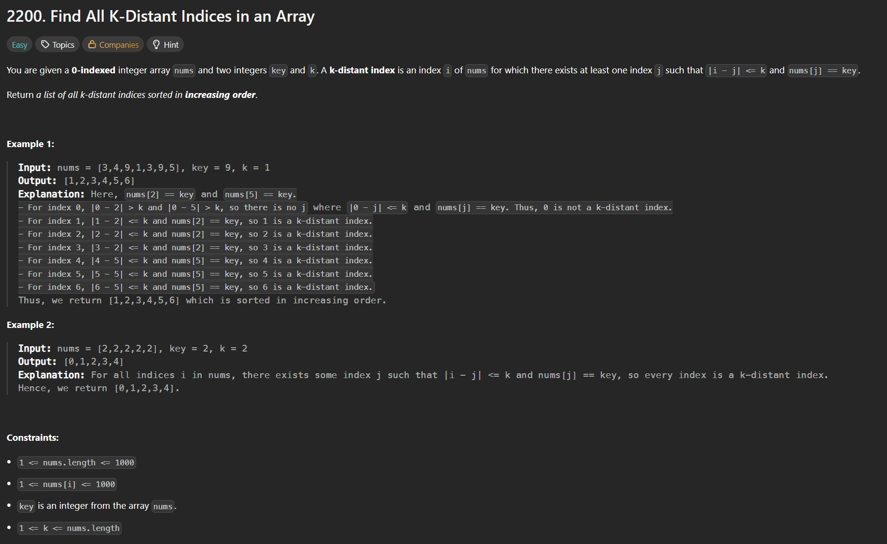

### Editorial Solutions

#### Approach One: Enumeration

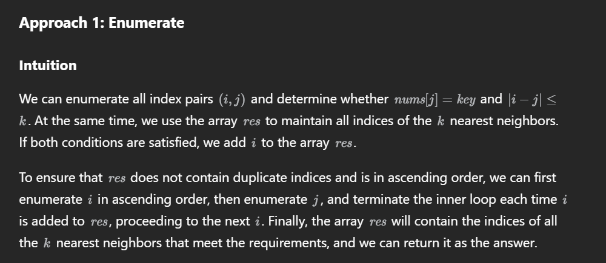

```
public class Solution {
    public IList<int> FindKDistantIndices(int[] nums, int key, int k) {
        List<int> res = new List<int>();
        int n = nums.Length;
        // traverse number pairs
        for (int i = 0; i < n; ++i) {
            for (int j = 0; j < n; ++j) {
                if (nums[j] == key && Math.Abs(i - j) <= k) {
                    res.Add(i);
                    break;  // early termination to prevent duplicate addition
                }
            }
        }
        return res;
    }
}
```

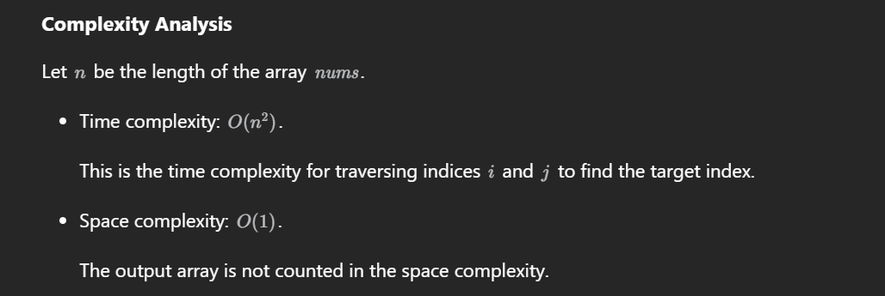

#### Approach Two: One-Time Traversal

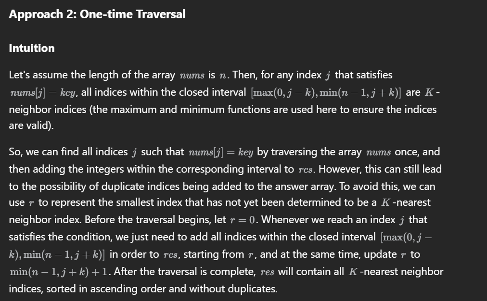

```
public class Solution {
    public IList<int> FindKDistantIndices(int[] nums, int key, int k) {
        List<int> res = new List<int>();
        int r = 0;  // unjudged minimum index
        int n = nums.Length;
        for (int j = 0; j < n; ++j) {
            if (nums[j] == key) {
                int l = Math.Max(r, j - k);
                r = Math.Min(n - 1, j + k) + 1;
                for (int i = l; i < r; ++i) {
                    res.Add(i);
                }
            }
        }
        return res;
    }
}
```

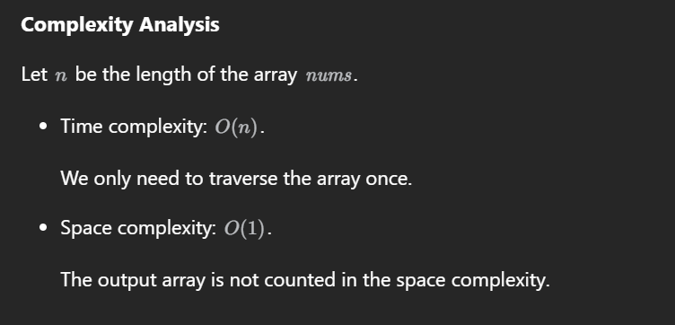

</details>

# The LeetCode Beginner's Guide

## LeetCode #1480: Running Sum of 1d Array

<details>
  <Summary>#1480</Summary>

### Overview

Given an array `nums`. We define a running sum of an array as `runningSum[i] = sum(nums[0]…nums[i])`.

Return the running sum of `nums`.

#### Example 1:

```
Input: nums = [1,2,3,4]
Output: [1,3,6,10]
Explanation: Running sum is obtained as follows: [1, 1+2, 1+2+3, 1+2+3+4].
```

#### Example 2:

```
Input: nums = [1,1,1,1,1]
Output: [1,2,3,4,5]
Explanation: Running sum is obtained as follows: [1, 1+1, 1+1+1, 1+1+1+1, 1+1+1+1+1].
```

#### Example 3:

```
Input: nums = [3,1,2,10,1]
Output: [3,4,6,16,17]
```

#### Constraints

1 <= nums.length <= 1000

-10^6 <= nums[i] <= 10^6

### Explanation

#### LeetCode Video Solution

##### Java

```
class Solution {
  public int[] runningSum(int[] nums) {
    int[] results = new int[nums.length];
    results[0] = nums[0];

    for (int i = 1; i < nums.length; i++) {
      results[i] = nums[i] + results[i-1];
    }

    return results;
  }

  //time complexity = O(n)
  //space complexity = O(1)
}
```

Time Complexity: O(n)

Space Complexity: O(1) --> constant

##### Alternative Solution

This solution makes it so that we don't need to create a new array. We will overwrite the input array.

Overwritten Input Complexity:

Time Complexity: O(n)

Space Complexity: O(1)

```
class Solution {
  public int[] runningSum(int[] nums) {
    for (int i = 1; i < nums.length; i++) {
      nums[i] += nums[i-1];
    }

    return nums;
  }

  //time complexity = O(n)
  //space complexity = O(1)
}
```

Comments suggest the in-place version is poor practice because the method caller may not expect you to alter the values you are giving them. If the language passes this data by reference you may cause un-expected side effects by altering the values.

</details>

## LeetCode #1672: Richest Customer Wealth

<details>
  <summary>#1672</summary>

### Overview

You are given an `m x n` integer grid `accounts` where `accounts[i][j]` is the amount of money the `i​​​​​​​​​​​th`​​​​ customer has in the `j​​​​​​​​​​​th`​​​​ bank. Return the **wealth** that the richest customer has.

A customer's **wealth** is the amount of money they have in all their bank accounts. The richest customer is the customer that has the maximum **wealth**.

#### Example 1:

```
Input: accounts = [[1,2,3],[3,2,1]]
Output: 6
Explanation:
1st customer has wealth = 1 + 2 + 3 = 6
2nd customer has wealth = 3 + 2 + 1 = 6
Both customers are considered the richest with a wealth of 6 each, so return 6.
```

#### Example 2:

```
Input: accounts = [[1,5],[7,3],[3,5]]
Output: 10
Explanation:
1st customer has wealth = 6
2nd customer has wealth = 10
3rd customer has wealth = 8
The 2nd customer is the richest with a wealth of 10.
```

#### Example 3:

```
Input: accounts = [[2,8,7],[7,1,3],[1,9,5]]
Output: 17
```

#### Constraints:

m == accounts.length

n == accounts[i].length

1 <= m, n <= 50

1 <= accounts[i][j] <= 100

### Explanation

Can imagine as a matrix/grid.

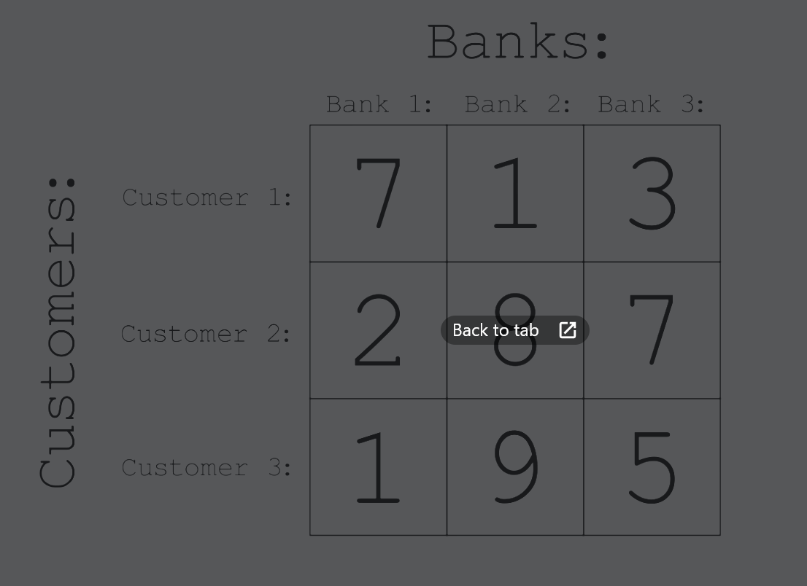

#### LeetCode Video Solution

Time Complexity: O(n x m)

Space Complexity: O(1)

```
class Solution {
  public int maximumWealth(int[][] accounts) {
    int maxWealthSoFar = 0;

    for (int[] customer: accounts) {
      int currentCustomerWealth = 0;

      for (int bank: customer) {
        currentCustomerWealth += bank;
      }

      maxWealthSoFar = Math.max(maxWealthSoFar, currentCustomerWealth);
    }

    return maxWealthSoFar;
  }

  //Time Complexity: O(n x m)
  //Space Complexity: O(1)
}
```

##### Analysis

It's still just two for loops. I'm really surprised there isn't a more optimal solution. I would have expected there to be a way to avoid two for loops since it causes a O(n^2) or O(n \* m).

</details>

## LeetCode #412: Fizz Buzz

<details>
<summary>#412</summary>

### Overview

Given an integer `n`, return a string array `answer` (_1-indexed_) where:

`answer[i] == "FizzBuzz"` if `i` is divisible by `3` and `5`.

`answer[i] == "Fizz"` if `i` is divisible by `3`.

`answer[i] == "Buzz"` if `i` is divisible by `5`.

`answer[i] == i` (as a string) if none of the above conditions are true.

#### Example 1:

Input: n = 3

Output: ["1","2","Fizz"]

#### Example 2:

Input: n = 5

Output: ["1","2","Fizz","4","Buzz"]

#### Example 3:

Input: n = 15

Output: ["1","2","Fizz","4","Buzz","Fizz","7","8","Fizz","Buzz","11","Fizz","13","14","FizzBuzz"]

#### Constraints:

1 <= n <= 10^4

### Explanation

Time Complexity: O(n)

Space Complexity: O(1) --> only 1 because the space we are using is not used in the calculation only for output.

#### LeetCode Video Solution

```
class Solution {
  public List<String> fizzBuzz(int n) {
    List<String> answer = new ArrayList<>(n);

    for (int i = 1; i <= n; i++) {
      boolean divisibleBy3 = i % 3 == 0;
      boolean divisibleBy5 = i % 5 == 0;

      if (divisibleBy3 && divisibleBy5) {
        answer.add("FizzBuzz");
      } else if (divisibleBy3) {
        answer.add("Fizz");
      } else if (divisibleBy5) {
        answer.add("Buzz");
      } else {
        answer.add(String.valueOf(i));
      }
    }

    return answer;

    //Time Complexity: O(n)
    //Space Complexity: O(1)
  }
}
```

#### String Concatenation Approach

Time Complexity: O(n)

Space Complexity: O(1)

```
class Solution {
  public List<String> fizzBuzz(int n) {
    List<String> answer = new ArrayList<>(n);

    for (int i = 1; i <= n; i++) {
      boolean divisibleBy3 = i % 3 == 0;
      boolean divisibleBy5 = i % 5 == 0;

      String currStr = "";

      if (divisibleBy3) {
        currStr += "Fizz";
      }

      if (divisibleBy5) {
        currStr += "Buzz";
      }

      if (currStr.isEmpty()) {
        currStr += String.valueOf(i);
      }

      answer.add(currStr);
    }

    return answer;

    //Time Complexity: O(n)
    //Space Complexity: O(1)
  }
}
```

</details>

## LeetCode #1342: Number of Steps to Reduce a Number to Zero

<details>
<summary>#1342</summary>

### Overview

Given an integer `num`, return _the number of steps to reduce it to zero_.

In one step, if the current number is even, you have to divide it by `2`, otherwise, you have to subtract `1` from it.

#### Example 1:

**Input:** num = 14

**Output:** 6

**Explanation:**

Step 1) 14 is even; divide by 2 and obtain 7.

Step 2) 7 is odd; subtract 1 and obtain 6.

Step 3) 6 is even; divide by 2 and obtain 3.

Step 4) 3 is odd; subtract 1 and obtain 2.

Step 5) 2 is even; divide by 2 and obtain 1.

Step 6) 1 is odd; subtract 1 and obtain 0.

#### Example 2:

**Input:** num = 8

**Output:** 4

**Explanation:**

Step 1) 8 is even; divide by 2 and obtain 4.

Step 2) 4 is even; divide by 2 and obtain 2.

Step 3) 2 is even; divide by 2 and obtain 1.

Step 4) 1 is odd; subtract 1 and obtain 0.

#### Example 3:

**Input:** num = 123

**Output:** 12

#### Constraints:

0 <= num <= 10^6

### Explanation

6 / 2 = 3 --> halfing step

3 - 1 = 2 --> subtracting step

2 / 2 = 1

1 - 1 = 0

input: 6; output: 4

Time Complexity: O(logn)

**30** _15_ **14** _7_ **6** _3_ **2** _1_ 0

**halfing steps** _subtracting steps_

logn + logn

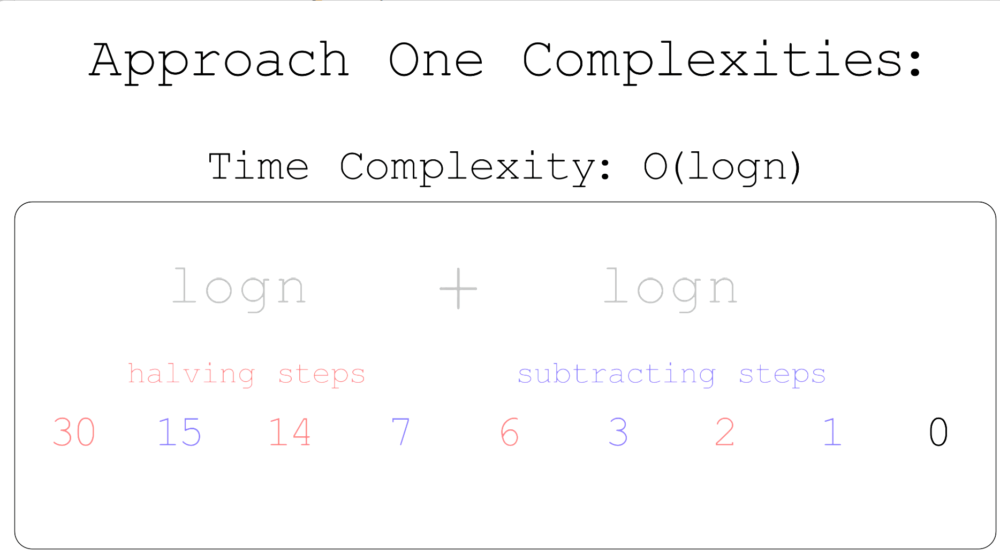

Space Complexity: O(1)

We do not create a data structure proportional in size to the size of our input

#### LeetCode Video Soltuion

```
class Solution {
  public int numberOfSteps(int num) {
    int steps = 0;

    while (num > 0) {
      if (num % 2 == 0) {
        num /= 2;
      } else
      {
        num--;
      }

      steps++;
    }

    return steps;
  }

  //Time Complexity = O(logn)
  //Space Complexity = O(1)
}
```

#### Bitwise Approach

This does not improve time or space complexity.

Alt way of thinking, may help with other problems.

- Binary representation of integers

- Bitwise Shift Operators

- Bitwise Logical Operators

- Bitmasks

Advanced Concepts
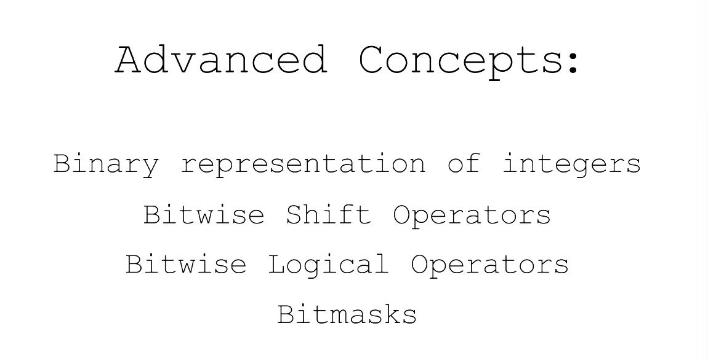

Binary Rep Of Ints
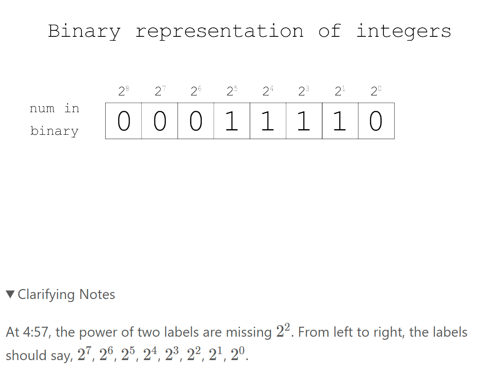

Convert To Decimal
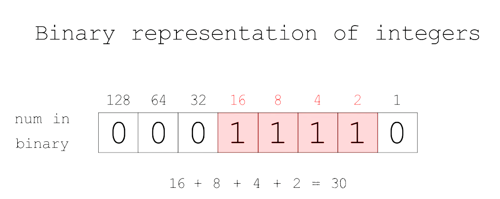

Half in Binary Shift Right
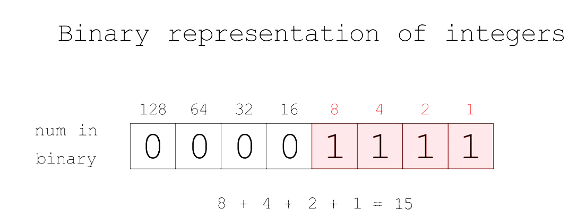

Odd in binary rightmost has value of 1
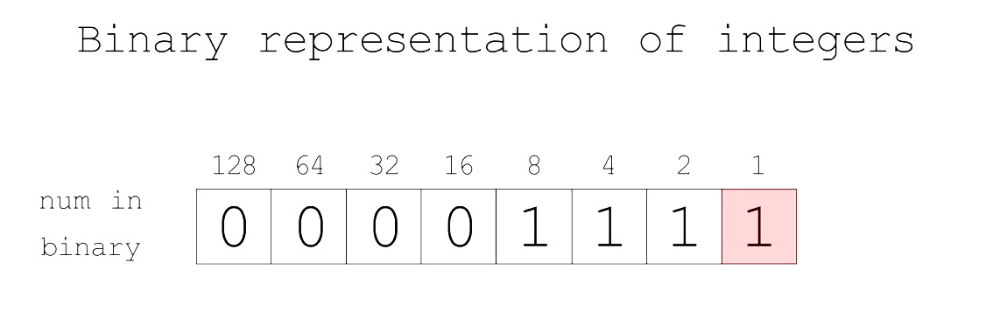

Bitwise operators
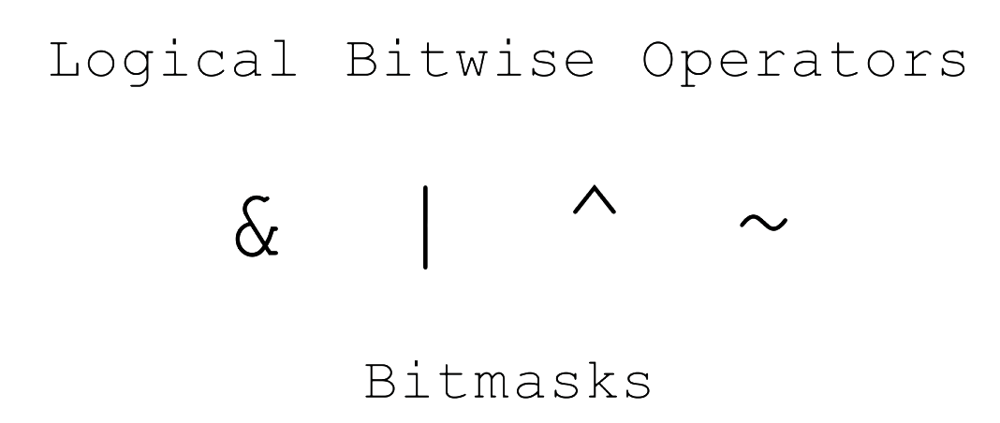

What bitwise ops do
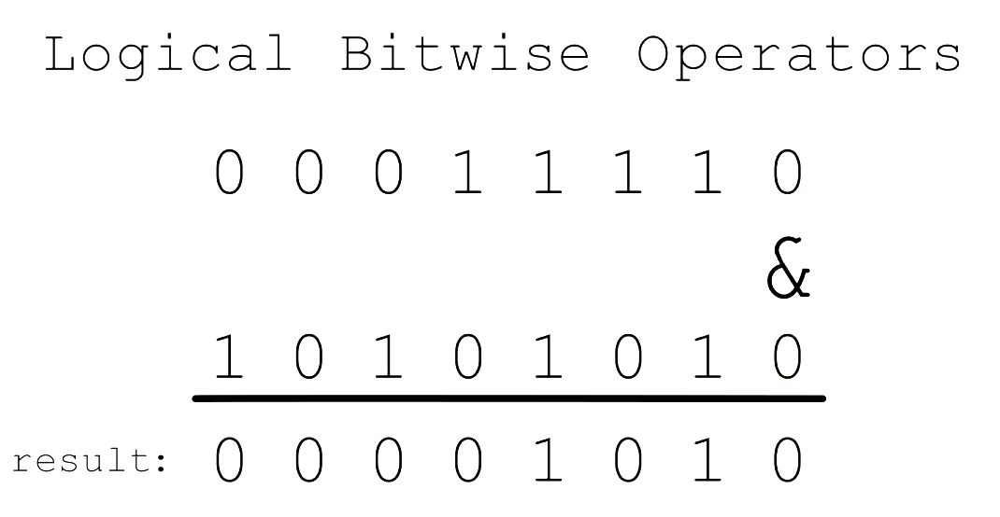
Time Complexity O(logn)

Mirror Bool Ops
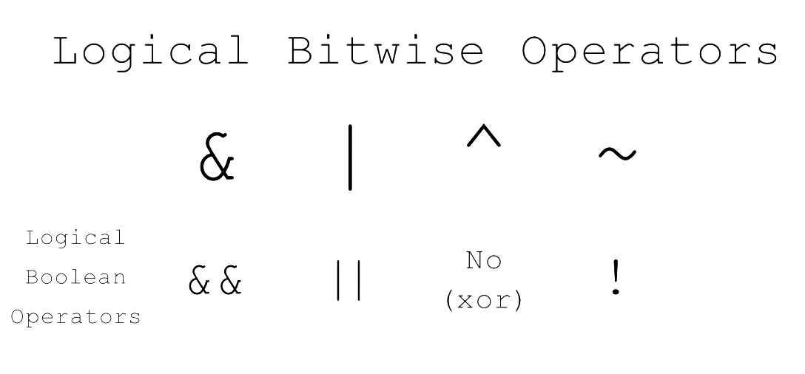

Differences
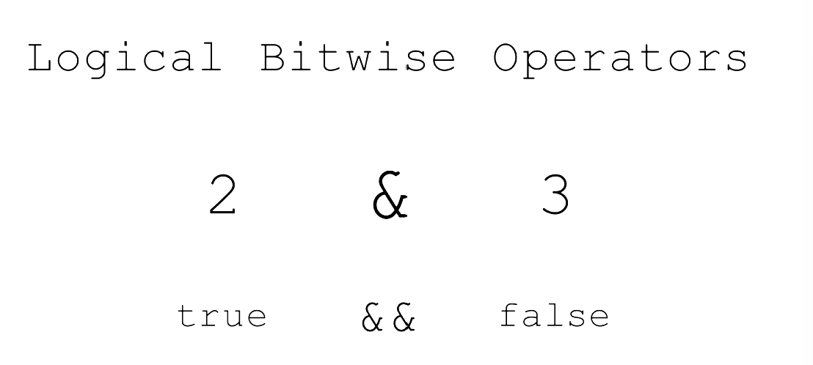
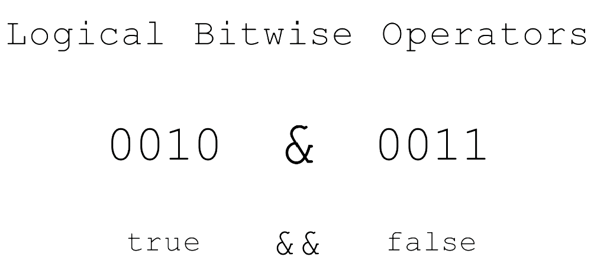

Bitmask
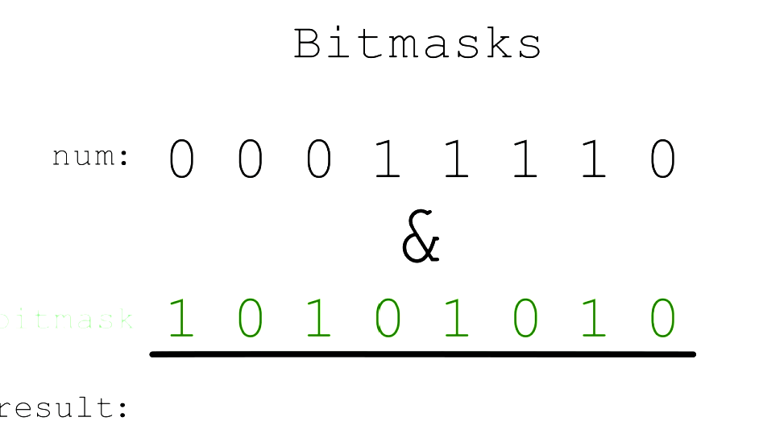

Our bitmask to check even/odd
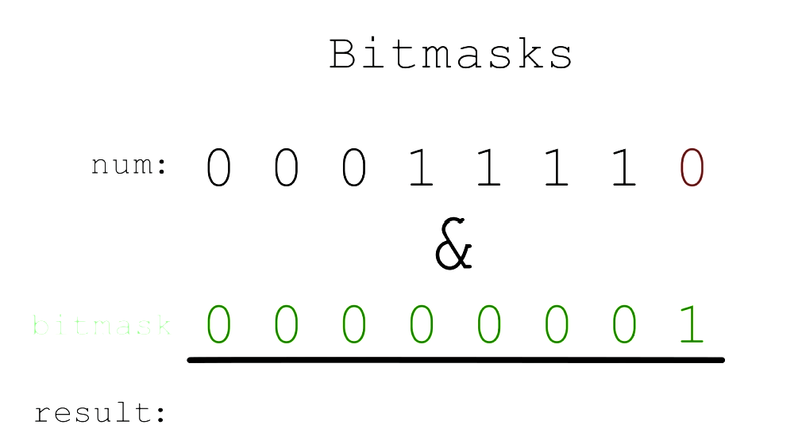

if value in num is 0, we get 0 and if num is 1 we get num. So depends on value in rightmost position due to our bitmask being 00000001. The bitmask 0 positions are not checked, only where the bitmask has a 1 is the corresponding value checked in our num value.

Space Complexity O(1)

```
class Soltuion {
  public int numberOfSteps(int num) {
    int steps = 0;

    while (num > 0) {
      //Before we used num % 2
      if ((num & 1) == 0) { //num: xxxxxx0 & bitmask: 0000001
        //Before we used num /= 2
        num >>= 1; //num = num >> 1;
      } else
      {
        num--;
      }

      steps++;
    }

    return steps;
  }

  //Time Complexity = O(logn)
  //Space Complexity = O(1)
}
```

</details>

## LeetCode #876: Middle of the Linked List

<details>
<summary>#876</summary>

### Overview

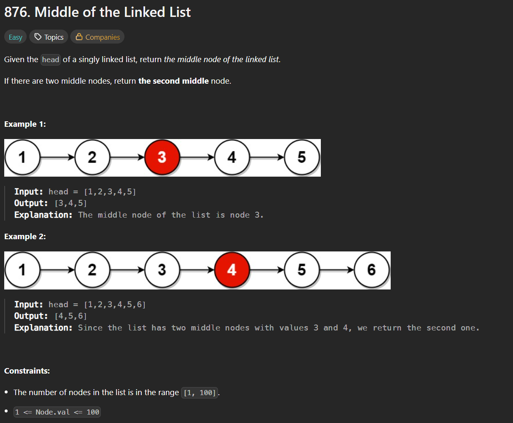

### Explanation

Conceptual Overview

Node / LinkedList

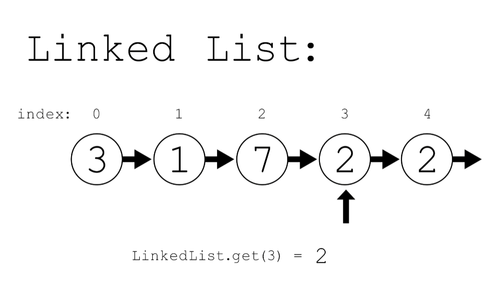

Middle Node

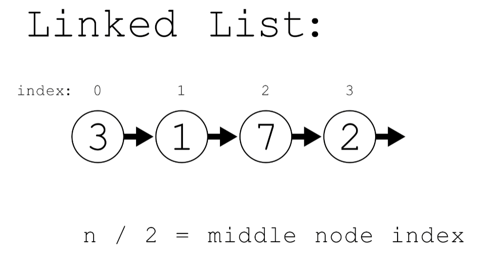

#### LeetCode Video Solution

##### Approach One

Spit values out into an array while keeping track of the LinkedLists total count.

Time Complexity: O(n)

Space Complexity: O(n)

```
class Solution {
  public ListNode middleNode(ListNode head) {
    ArrayList<ListNode> array = new ArrayList<>();

    int length = 0;
    while (head != null) {
      array.add(head);
      head = head.next;
      length++;
    }

    return array.get(length / 2);
  }

  //time complexity O(n)
  //space complexity O(n)
}
```

#### Approach Two

In an interview you would be expected to interact with the linked list. Using an array defeats the purpose of the linked list.

How do we do this? --> Use pointers.

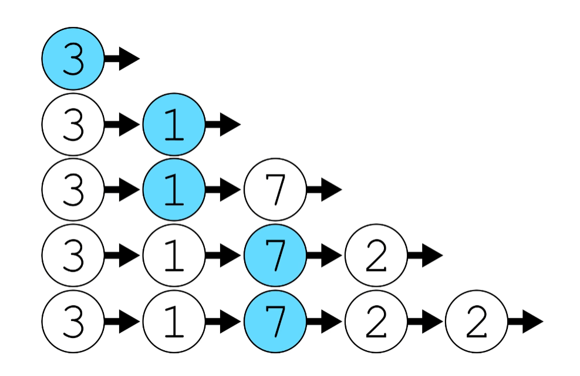

Time Complexity: O(n)

Space Complexity: O(1)

```
class Solution {
  public ListNode middleNode(ListNode head) {
    ListNode middle = head;
    ListNode end = head;;

    while (end != null && end.next != null) { // 3 1 2 7 7
      middle = middle.next;
      end = end.next.next;
    }

    return middle;
  }

  //time complexity O(n)
  //space complexity O(1)
}
```

</details>

## LeetCode #383: Ransome Note

<details>
<summary>#383</summary>

### Overview

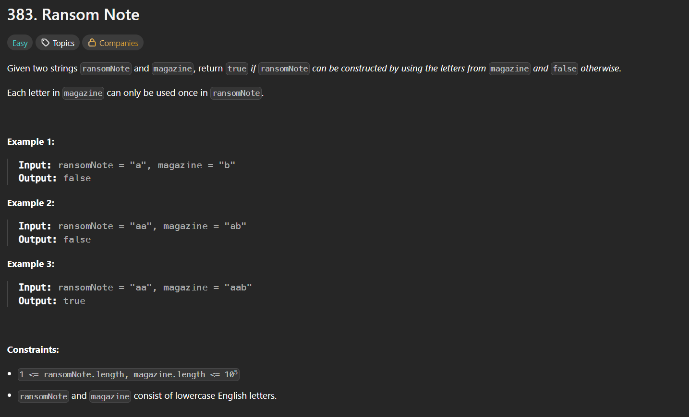

### Explanation

During the explanation it stated that removing letters from magazine requires saving the new string in a temp string and then reinitalizing magazine because strings are immutable.

#### LeetCode Video Solution

##### Approach One

In the first approach the solution is suggesting going through each letter in ransom note, checking for existance in magazine and then removing existing letter from magazine and moving to next letter in ransome note and repeating.

Time Complexity: O(n\*m)

Space Complexity: O(m)

```
class Solution {
  public boolean canConstruct(String ransomNote, String magazine) {
    for (int i = 0; i < ransomNote.length(); i++) {
      char r = ransomeNote.charAt(i);

      int matchingIndex = magazine.indexOf(r);

      if (matchingIndex == -1) {
        return false;
      }

      magazine = magazine.substring(0, matchingIndex) + magazine.substring(matchingIndex + 1);
    }

    return true;
  }

  //time complexity: O(n*m)
  //space complexity: O(m)
}
```

##### HashMap approach

Time Complexity: O(m)

magainze.length >= ransomNote.length --> if not true then not enough letters to write ransom note, just jump out.

the complexity depends on the **longer** of the two strings, magazine

Space Complexity: O(k)

k means distinct letters in magazine

k --> 26

since k is upper bound can say

Space Complexity: O(1)

```
class Solution {
  public boolean canConstruct(String ransomNote, String magazine) {
    HashMap<Character, Integer> magazineLetters = new HashMap<>(); //k = 26

    for (int i = 0; i < magazine.length(); i++) {
      char c = magazine.charAt(i);

      int currentCount = magainzeLetter.getOrDefault(m, 0);
      magazineLetters.put(m, currentCount + 1);
    }

    //bounded by m
    for (int i = 0; i < ransomNote.length(); i++) {
      char r = ransomNote.charAt(i);

      int currentCount = magazineLetters.getOrDefault(r, 0);

      if (currentCount == 0) {
        return false;
      }

      magazineLetter.put(r, currentCount - 1);
    }

    return true;
  }

  //time complexity: O(m)
  //space complexity: O(k)
}
```

HashMap Space Complexity Correction

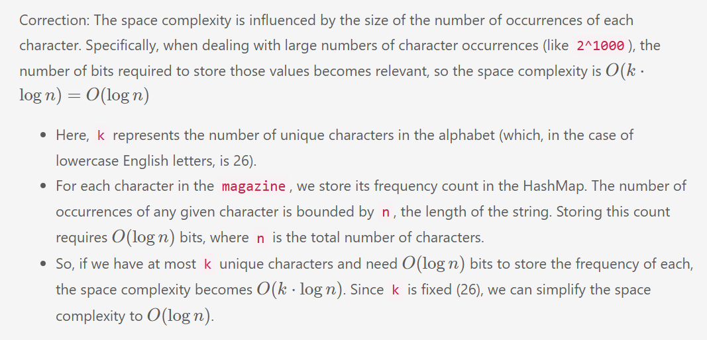

</details>
