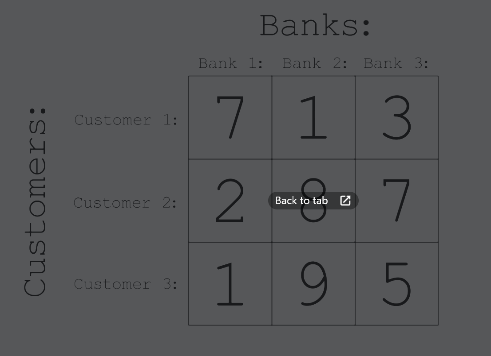

# Optimal Solutions - General Practice

## LeetCode #1: Two Sum

## LeetCode #2: Add Two Numbers

## LeetCode #3: Longest substring without repeating characters

<details>
  <summary>write-up</summary>

Given a string s, find the length of the longest
substring without repeating characters.

```
Example 1:
Input: s = "abcabcbb"
Output: 3
Explanation: The answer is "abc", with the length of 3.
```

```
Example 2:
Input: s = "bbbbb"
Output: 1
Explanation: The answer is "b", with the length of 1.
```

```
Example 3:
Input: s = "pwwkew"
Output: 3
Explanation: The answer is "wke", with the length of 3.
Notice that the answer must be a substring, "pwke" is a subsequence and not a substring.
```

#### Constraints:

0 <= s.length <= 5 \* 10^4

s consists of English letters, digits, symbols and spaces.

### a.k.a. Sliding Window

#### Explanation

The optimal solution is to use a hash set ... and a "sliding window".

##### Sliding Window

The idea is to have a sliding window.

So if the given string is "abcabcbb"

At first we will have a window of --> 'a' (_the window are the values currently stored in the set_)

Then we add 'b' --> 'ab'

Then we add 'c' --> 'abc'

Then we add 'a' --> 'abca'. When we reach the repeating 'a' character we remove the first duplicate 'a' (_from the left_), leaving us with 'bca'.

Then we add 'b' --> 'bcab', again remove repeats from the left side, leaving us with 'cab'

Then we add 'c' to the right --> 'cabc', and once again remove duplicates from the left, leaving us with 'abc'.

Now the interesting part, we will add the next 'b' giving us 'abcb', we need to remove characters from the left until we remove the duplicate. So first we remove 'a' --> bcb, then 'b' --> 'cb'. Leaving us with 'cb'.

Then we add the next 'b' --> 'cbb', once again start removing letters from the left until we remove the duplicate so 'cbb' becomes --> 'bb' --> 'b'.

So in the end we are left with only 'b' in the set.

But we should have been keeping track of the longest substring for each pass. which was 'abc' --> length of 3.

##### Step-by-step

Given: 'abcabcbb'

Start: ''

Step 1: '' add 'a' --> 'a'

Step 2: 'a' add 'b' --> 'ab'

Step 3: 'ab' add 'c' --> 'abc'

Step 4: 'abc' add 'a' --> 'abca' remove up to duplicate 'a' --> 'bca'

Step 5: 'bca' add 'b' --> 'bcab' remove up to duplicate 'b' --> 'cab'

Step 6: 'cab' add 'c' --> 'cabc' remove up to duplicate 'c' --> 'abc'

Step 7: 'abc' add 'b' --> 'abcb' remove up to duplicate 'b' --> 'cb'

Step 8: 'cb' add 'b' --> 'cbb' remove up to duplicate 'b' --> 'b'

##### C#

```
    public class OptimalSolution
    {
        public int LengthOfLongestSubstring(string s)
        {
            var charSet = new HashSet<char>();
            int left = 0, maxLength = 0;

            for (int right = 0; right < s.Length; right++)
            {
                while (charSet.Contains(s[right]))
                {
                    charSet.Remove(s[left++]);
                }

                charSet.Add(s[right]);
                maxLength = Math.Max(maxLength, right - left + 1);
            }

            return maxLength;
        }
    }
```

##### Python

```
class Solution:
  def lengthOfLongestSubstring(self, s: str) -> int:
    charSet = set()
    l = 0
    res = 0

    for r in range(len(s)):
      while s[r] in charSet:
        charSet.remove(s[l])
        l += 1
      charSet.add(s[r])
      res = max(res, r - l + 1)
    return res
```

</details>

# The LeetCode Beginner's Guide

## LeetCode #1480: Running Sum of 1d Array

<details>
  <Summary>#1480</Summary>

### Overview

Given an array `nums`. We define a running sum of an array as `runningSum[i] = sum(nums[0]…nums[i])`.

Return the running sum of `nums`.

#### Example 1:

```
Input: nums = [1,2,3,4]
Output: [1,3,6,10]
Explanation: Running sum is obtained as follows: [1, 1+2, 1+2+3, 1+2+3+4].
```

#### Example 2:

```
Input: nums = [1,1,1,1,1]
Output: [1,2,3,4,5]
Explanation: Running sum is obtained as follows: [1, 1+1, 1+1+1, 1+1+1+1, 1+1+1+1+1].
```

#### Example 3:

```
Input: nums = [3,1,2,10,1]
Output: [3,4,6,16,17]
```

#### Constraints

1 <= nums.length <= 1000

-10^6 <= nums[i] <= 10^6

### Explanation

#### LeetCode Video Solution

##### Java

```
class Solution {
  public int[] runningSum(int[] nums) {
    int[] results = new int[nums.length];
    results[0] = nums[0];

    for (int i = 1; i < nums.length; i++) {
      results[i] = nums[i] + results[i-1];
    }

    return results;
  }

  //time complexity = O(n)
  //space complexity = O(1)
}
```

Time Complexity: O(n)

Space Complexity: O(1) --> constant

##### Alternative Solution

This solution makes it so that we don't need to create a new array. We will overwrite the input array.

Overwritten Input Complexity:

Time Complexity: O(n)

Space Complexity: O(1)

```
class Solution {
  public int[] runningSum(int[] nums) {
    for (int i = 1; i < nums.length; i++) {
      nums[i] += nums[i-1];
    }

    return nums;
  }

  //time complexity = O(n)
  //space complexity = O(1)
}
```

Comments suggest the in-place version is poor practice because the method caller may not expect you to alter the values you are giving them. If the language passes this data by reference you may cause un-expected side effects by altering the values.

</details>

## LeetCode #1672: Richest Customer Wealth

<details>
  <summary>#1672</summary>

### Overview

You are given an `m x n` integer grid `accounts` where `accounts[i][j]` is the amount of money the `i​​​​​​​​​​​th`​​​​ customer has in the `j​​​​​​​​​​​th`​​​​ bank. Return the **wealth** that the richest customer has.

A customer's **wealth** is the amount of money they have in all their bank accounts. The richest customer is the customer that has the maximum **wealth**.

#### Example 1:

```
Input: accounts = [[1,2,3],[3,2,1]]
Output: 6
Explanation:
1st customer has wealth = 1 + 2 + 3 = 6
2nd customer has wealth = 3 + 2 + 1 = 6
Both customers are considered the richest with a wealth of 6 each, so return 6.
```

#### Example 2:

```
Input: accounts = [[1,5],[7,3],[3,5]]
Output: 10
Explanation:
1st customer has wealth = 6
2nd customer has wealth = 10
3rd customer has wealth = 8
The 2nd customer is the richest with a wealth of 10.
```

#### Example 3:

```
Input: accounts = [[2,8,7],[7,1,3],[1,9,5]]
Output: 17
```

#### Constraints:

m == accounts.length

n == accounts[i].length

1 <= m, n <= 50

1 <= accounts[i][j] <= 100

### Explanation

Can imagine as a matrix/grid.



#### LeetCode Video Solution

Time Complexity: O(n x m)

Space Complexity: O(1)

```
class Solution {
  public int maximumWealth(int[][] accounts) {
    int maxWealthSoFar = 0;

    for (int[] customer: accounts) {
      int currentCustomerWealth = 0;

      for (int bank: customer) {
        currentCustomerWealth += bank;
      }

      maxWealthSoFar = Math.max(maxWealthSoFar, currentCustomerWealth);
    }

    return maxWealthSoFar;
  }

  //Time Complexity: O(n x m)
  //Space Complexity: O(1)
}
```

##### Analysis

It's still just two for loops. I'm really surprised there isn't a more optimal solution. I would have expected there to be a way to avoid two for loops since it causes a O(n^2) or O(n \* m).

</details>
