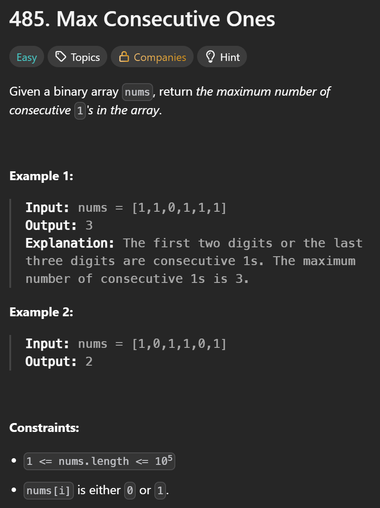

# LeetCode Pathing


# General Practice

## LeetCode #1: Two Sum

## LeetCode #2: Add Two Numbers

## LeetCode #3: Longest substring without repeating characters

<details>
  <summary>write-up</summary>

Given a string s, find the length of the longest
substring without repeating characters.

```
Example 1:
Input: s = "abcabcbb"
Output: 3
Explanation: The answer is "abc", with the length of 3.
```

```
Example 2:
Input: s = "bbbbb"
Output: 1
Explanation: The answer is "b", with the length of 1.
```

```
Example 3:
Input: s = "pwwkew"
Output: 3
Explanation: The answer is "wke", with the length of 3.
Notice that the answer must be a substring, "pwke" is a subsequence and not a substring.
```

#### Constraints:

0 <= s.length <= 5 \* 10^4

s consists of English letters, digits, symbols and spaces.

### a.k.a. Sliding Window

#### Explanation

The optimal solution is to use a hash set ... and a "sliding window".

##### Sliding Window

The idea is to have a sliding window.

So if the given string is "abcabcbb"

At first we will have a window of --> 'a' (_the window are the values currently stored in the set_)

Then we add 'b' --> 'ab'

Then we add 'c' --> 'abc'

Then we add 'a' --> 'abca'. When we reach the repeating 'a' character we remove the first duplicate 'a' (_from the left_), leaving us with 'bca'.

Then we add 'b' --> 'bcab', again remove repeats from the left side, leaving us with 'cab'

Then we add 'c' to the right --> 'cabc', and once again remove duplicates from the left, leaving us with 'abc'.

Now the interesting part, we will add the next 'b' giving us 'abcb', we need to remove characters from the left until we remove the duplicate. So first we remove 'a' --> bcb, then 'b' --> 'cb'. Leaving us with 'cb'.

Then we add the next 'b' --> 'cbb', once again start removing letters from the left until we remove the duplicate so 'cbb' becomes --> 'bb' --> 'b'.

So in the end we are left with only 'b' in the set.

But we should have been keeping track of the longest substring for each pass. which was 'abc' --> length of 3.

##### Step-by-step

Given: 'abcabcbb'

Start: ''

Step 1: '' add 'a' --> 'a'

Step 2: 'a' add 'b' --> 'ab'

Step 3: 'ab' add 'c' --> 'abc'

Step 4: 'abc' add 'a' --> 'abca' remove up to duplicate 'a' --> 'bca'

Step 5: 'bca' add 'b' --> 'bcab' remove up to duplicate 'b' --> 'cab'

Step 6: 'cab' add 'c' --> 'cabc' remove up to duplicate 'c' --> 'abc'

Step 7: 'abc' add 'b' --> 'abcb' remove up to duplicate 'b' --> 'cb'

Step 8: 'cb' add 'b' --> 'cbb' remove up to duplicate 'b' --> 'b'

##### C#

```
    public class OptimalSolution
    {
        public int LengthOfLongestSubstring(string s)
        {
            var charSet = new HashSet<char>();
            int left = 0, maxLength = 0;

            for (int right = 0; right < s.Length; right++)
            {
                while (charSet.Contains(s[right]))
                {
                    charSet.Remove(s[left++]);
                }

                charSet.Add(s[right]);
                maxLength = Math.Max(maxLength, right - left + 1);
            }

            return maxLength;
        }
    }
```

##### Python

```
class Solution:
  def lengthOfLongestSubstring(self, s: str) -> int:
    charSet = set()
    l = 0
    res = 0

    for r in range(len(s)):
      while s[r] in charSet:
        charSet.remove(s[l])
        l += 1
      charSet.add(s[r])
      res = max(res, r - l + 1)
    return res
```

</details>

# Daily Challenges

## LeetCode 2200: Find All K-Distant Indices in an Array

<details>
<summary>#2200</summary>

### Overview


### Editorial Solutions

#### Approach One: Enumeration


```
public class Solution {
    public IList<int> FindKDistantIndices(int[] nums, int key, int k) {
        List<int> res = new List<int>();
        int n = nums.Length;
        // traverse number pairs
        for (int i = 0; i < n; ++i) {
            for (int j = 0; j < n; ++j) {
                if (nums[j] == key && Math.Abs(i - j) <= k) {
                    res.Add(i);
                    break;  // early termination to prevent duplicate addition
                }
            }
        }
        return res;
    }
}
```


#### Approach Two: One-Time Traversal


```
public class Solution {
    public IList<int> FindKDistantIndices(int[] nums, int key, int k) {
        List<int> res = new List<int>();
        int r = 0;  // unjudged minimum index
        int n = nums.Length;
        for (int j = 0; j < n; ++j) {
            if (nums[j] == key) {
                int l = Math.Max(r, j - k);
                r = Math.Min(n - 1, j + k) + 1;
                for (int i = l; i < r; ++i) {
                    res.Add(i);
                }
            }
        }
        return res;
    }
}
```


</details>

# The LeetCode Beginner's Guide

## LeetCode #1480: Running Sum of 1d Array

<details>
  <Summary>#1480</Summary>

### Overview

Given an array `nums`. We define a running sum of an array as `runningSum[i] = sum(nums[0]…nums[i])`.

Return the running sum of `nums`.

#### Example 1:

```
Input: nums = [1,2,3,4]
Output: [1,3,6,10]
Explanation: Running sum is obtained as follows: [1, 1+2, 1+2+3, 1+2+3+4].
```

#### Example 2:

```
Input: nums = [1,1,1,1,1]
Output: [1,2,3,4,5]
Explanation: Running sum is obtained as follows: [1, 1+1, 1+1+1, 1+1+1+1, 1+1+1+1+1].
```

#### Example 3:

```
Input: nums = [3,1,2,10,1]
Output: [3,4,6,16,17]
```

#### Constraints

1 <= nums.length <= 1000

-10^6 <= nums[i] <= 10^6

### Explanation

#### LeetCode Video Solution

##### Java

```
class Solution {
  public int[] runningSum(int[] nums) {
    int[] results = new int[nums.length];
    results[0] = nums[0];

    for (int i = 1; i < nums.length; i++) {
      results[i] = nums[i] + results[i-1];
    }

    return results;
  }

  //time complexity = O(n)
  //space complexity = O(1)
}
```

Time Complexity: O(n)

Space Complexity: O(1) --> constant

##### Alternative Solution

This solution makes it so that we don't need to create a new array. We will overwrite the input array.

Overwritten Input Complexity:

Time Complexity: O(n)

Space Complexity: O(1)

```
class Solution {
  public int[] runningSum(int[] nums) {
    for (int i = 1; i < nums.length; i++) {
      nums[i] += nums[i-1];
    }

    return nums;
  }

  //time complexity = O(n)
  //space complexity = O(1)
}
```

Comments suggest the in-place version is poor practice because the method caller may not expect you to alter the values you are giving them. If the language passes this data by reference you may cause un-expected side effects by altering the values.

</details>

## LeetCode #1672: Richest Customer Wealth

<details>
  <summary>#1672</summary>

### Overview

You are given an `m x n` integer grid `accounts` where `accounts[i][j]` is the amount of money the `i​​​​​​​​​​​th`​​​​ customer has in the `j​​​​​​​​​​​th`​​​​ bank. Return the **wealth** that the richest customer has.

A customer's **wealth** is the amount of money they have in all their bank accounts. The richest customer is the customer that has the maximum **wealth**.

#### Example 1:

```
Input: accounts = [[1,2,3],[3,2,1]]
Output: 6
Explanation:
1st customer has wealth = 1 + 2 + 3 = 6
2nd customer has wealth = 3 + 2 + 1 = 6
Both customers are considered the richest with a wealth of 6 each, so return 6.
```

#### Example 2:

```
Input: accounts = [[1,5],[7,3],[3,5]]
Output: 10
Explanation:
1st customer has wealth = 6
2nd customer has wealth = 10
3rd customer has wealth = 8
The 2nd customer is the richest with a wealth of 10.
```

#### Example 3:

```
Input: accounts = [[2,8,7],[7,1,3],[1,9,5]]
Output: 17
```

#### Constraints:

m == accounts.length

n == accounts[i].length

1 <= m, n <= 50

1 <= accounts[i][j] <= 100

### Explanation

Can imagine as a matrix/grid.


#### LeetCode Video Solution

Time Complexity: O(n x m)

Space Complexity: O(1)

```
class Solution {
  public int maximumWealth(int[][] accounts) {
    int maxWealthSoFar = 0;

    for (int[] customer: accounts) {
      int currentCustomerWealth = 0;

      for (int bank: customer) {
        currentCustomerWealth += bank;
      }

      maxWealthSoFar = Math.max(maxWealthSoFar, currentCustomerWealth);
    }

    return maxWealthSoFar;
  }

  //Time Complexity: O(n x m)
  //Space Complexity: O(1)
}
```

##### Analysis

It's still just two for loops. I'm really surprised there isn't a more optimal solution. I would have expected there to be a way to avoid two for loops since it causes a O(n^2) or O(n \* m).

</details>

## LeetCode #412: Fizz Buzz

<details>
<summary>#412</summary>

### Overview

Given an integer `n`, return a string array `answer` (_1-indexed_) where:

`answer[i] == "FizzBuzz"` if `i` is divisible by `3` and `5`.

`answer[i] == "Fizz"` if `i` is divisible by `3`.

`answer[i] == "Buzz"` if `i` is divisible by `5`.

`answer[i] == i` (as a string) if none of the above conditions are true.

#### Example 1:

Input: n = 3

Output: ["1","2","Fizz"]

#### Example 2:

Input: n = 5

Output: ["1","2","Fizz","4","Buzz"]

#### Example 3:

Input: n = 15

Output: ["1","2","Fizz","4","Buzz","Fizz","7","8","Fizz","Buzz","11","Fizz","13","14","FizzBuzz"]

#### Constraints:

1 <= n <= 10^4

### Explanation

Time Complexity: O(n)

Space Complexity: O(1) --> only 1 because the space we are using is not used in the calculation only for output.

#### LeetCode Video Solution

```
class Solution {
  public List<String> fizzBuzz(int n) {
    List<String> answer = new ArrayList<>(n);

    for (int i = 1; i <= n; i++) {
      boolean divisibleBy3 = i % 3 == 0;
      boolean divisibleBy5 = i % 5 == 0;

      if (divisibleBy3 && divisibleBy5) {
        answer.add("FizzBuzz");
      } else if (divisibleBy3) {
        answer.add("Fizz");
      } else if (divisibleBy5) {
        answer.add("Buzz");
      } else {
        answer.add(String.valueOf(i));
      }
    }

    return answer;

    //Time Complexity: O(n)
    //Space Complexity: O(1)
  }
}
```

#### String Concatenation Approach

Time Complexity: O(n)

Space Complexity: O(1)

```
class Solution {
  public List<String> fizzBuzz(int n) {
    List<String> answer = new ArrayList<>(n);

    for (int i = 1; i <= n; i++) {
      boolean divisibleBy3 = i % 3 == 0;
      boolean divisibleBy5 = i % 5 == 0;

      String currStr = "";

      if (divisibleBy3) {
        currStr += "Fizz";
      }

      if (divisibleBy5) {
        currStr += "Buzz";
      }

      if (currStr.isEmpty()) {
        currStr += String.valueOf(i);
      }

      answer.add(currStr);
    }

    return answer;

    //Time Complexity: O(n)
    //Space Complexity: O(1)
  }
}
```

</details>

## LeetCode #1342: Number of Steps to Reduce a Number to Zero

<details>
<summary>#1342</summary>

### Overview

Given an integer `num`, return _the number of steps to reduce it to zero_.

In one step, if the current number is even, you have to divide it by `2`, otherwise, you have to subtract `1` from it.

#### Example 1:

**Input:** num = 14

**Output:** 6

**Explanation:**

Step 1) 14 is even; divide by 2 and obtain 7.

Step 2) 7 is odd; subtract 1 and obtain 6.

Step 3) 6 is even; divide by 2 and obtain 3.

Step 4) 3 is odd; subtract 1 and obtain 2.

Step 5) 2 is even; divide by 2 and obtain 1.

Step 6) 1 is odd; subtract 1 and obtain 0.

#### Example 2:

**Input:** num = 8

**Output:** 4

**Explanation:**

Step 1) 8 is even; divide by 2 and obtain 4.

Step 2) 4 is even; divide by 2 and obtain 2.

Step 3) 2 is even; divide by 2 and obtain 1.

Step 4) 1 is odd; subtract 1 and obtain 0.

#### Example 3:

**Input:** num = 123

**Output:** 12

#### Constraints:

0 <= num <= 10^6

### Explanation

6 / 2 = 3 --> halfing step

3 - 1 = 2 --> subtracting step

2 / 2 = 1

1 - 1 = 0

input: 6; output: 4

Time Complexity: O(logn)

**30** _15_ **14** _7_ **6** _3_ **2** _1_ 0

**halfing steps** _subtracting steps_

logn + logn


Space Complexity: O(1)

We do not create a data structure proportional in size to the size of our input

#### LeetCode Video Soltuion

```
class Solution {
  public int numberOfSteps(int num) {
    int steps = 0;

    while (num > 0) {
      if (num % 2 == 0) {
        num /= 2;
      } else
      {
        num--;
      }

      steps++;
    }

    return steps;
  }

  //Time Complexity = O(logn)
  //Space Complexity = O(1)
}
```

#### Bitwise Approach

This does not improve time or space complexity.

Alt way of thinking, may help with other problems.

- Binary representation of integers

- Bitwise Shift Operators

- Bitwise Logical Operators

- Bitmasks

Advanced Concepts


Binary Rep Of Ints


Convert To Decimal


Half in Binary Shift Right


Odd in binary rightmost has value of 1


Bitwise operators


What bitwise ops do

Time Complexity O(logn)

Mirror Bool Ops


Differences


Bitmask


Our bitmask to check even/odd


if value in num is 0, we get 0 and if num is 1 we get num. So depends on value in rightmost position due to our bitmask being 00000001. The bitmask 0 positions are not checked, only where the bitmask has a 1 is the corresponding value checked in our num value.

Space Complexity O(1)

```
class Soltuion {
  public int numberOfSteps(int num) {
    int steps = 0;

    while (num > 0) {
      //Before we used num % 2
      if ((num & 1) == 0) { //num: xxxxxx0 & bitmask: 0000001
        //Before we used num /= 2
        num >>= 1; //num = num >> 1;
      } else
      {
        num--;
      }

      steps++;
    }

    return steps;
  }

  //Time Complexity = O(logn)
  //Space Complexity = O(1)
}
```

</details>

## LeetCode #876: Middle of the Linked List

<details>
<summary>#876</summary>

### Overview


### Explanation

Conceptual Overview

Node / LinkedList


Middle Node


#### LeetCode Video Solution

##### Approach One

Spit values out into an array while keeping track of the LinkedLists total count.

Time Complexity: O(n)

Space Complexity: O(n)

```
class Solution {
  public ListNode middleNode(ListNode head) {
    ArrayList<ListNode> array = new ArrayList<>();

    int length = 0;
    while (head != null) {
      array.add(head);
      head = head.next;
      length++;
    }

    return array.get(length / 2);
  }

  //time complexity O(n)
  //space complexity O(n)
}
```

#### Approach Two

In an interview you would be expected to interact with the linked list. Using an array defeats the purpose of the linked list.

How do we do this? --> Use pointers.


Time Complexity: O(n)

Space Complexity: O(1)

```
class Solution {
  public ListNode middleNode(ListNode head) {
    ListNode middle = head;
    ListNode end = head;;

    while (end != null && end.next != null) { // 3 1 2 7 7
      middle = middle.next;
      end = end.next.next;
    }

    return middle;
  }

  //time complexity O(n)
  //space complexity O(1)
}
```

</details>

## LeetCode #383: Ransome Note

<details>
<summary>#383</summary>

### Overview


### Explanation

During the explanation it stated that removing letters from magazine requires saving the new string in a temp string and then reinitalizing magazine because strings are immutable.

#### LeetCode Video Solution

##### Approach One

In the first approach the solution is suggesting going through each letter in ransom note, checking for existance in magazine and then removing existing letter from magazine and moving to next letter in ransome note and repeating.

Time Complexity: O(n\*m)

Space Complexity: O(m)

```
class Solution {
  public boolean canConstruct(String ransomNote, String magazine) {
    for (int i = 0; i < ransomNote.length(); i++) {
      char r = ransomeNote.charAt(i);

      int matchingIndex = magazine.indexOf(r);

      if (matchingIndex == -1) {
        return false;
      }

      magazine = magazine.substring(0, matchingIndex) + magazine.substring(matchingIndex + 1);
    }

    return true;
  }

  //time complexity: O(n*m)
  //space complexity: O(m)
}
```

##### HashMap approach

Time Complexity: O(m)

magainze.length >= ransomNote.length --> if not true then not enough letters to write ransom note, just jump out.

the complexity depends on the **longer** of the two strings, magazine

Space Complexity: O(k)

k means distinct letters in magazine

k --> 26

since k is upper bound can say

Space Complexity: O(1)

```
class Solution {
  public boolean canConstruct(String ransomNote, String magazine) {
    HashMap<Character, Integer> magazineLetters = new HashMap<>(); //k = 26

    for (int i = 0; i < magazine.length(); i++) {
      char c = magazine.charAt(i);

      int currentCount = magainzeLetter.getOrDefault(m, 0);
      magazineLetters.put(m, currentCount + 1);
    }

    //bounded by m
    for (int i = 0; i < ransomNote.length(); i++) {
      char r = ransomNote.charAt(i);

      int currentCount = magazineLetters.getOrDefault(r, 0);

      if (currentCount == 0) {
        return false;
      }

      magazineLetter.put(r, currentCount - 1);
    }

    return true;
  }

  //time complexity: O(m)
  //space complexity: O(k)
}
```

HashMap Space Complexity Correction


</details>

# Introduction to Data Structure: Arrays 101

## Introduction

<details>
<summary>Notes</summary>

### Array - A DVD box?

Suppose you had a bunch of DVDs at home that you wanted to arrange neatly. What would be the ideal choice for storing such a thing? You could find a cardboard box (or some other box) big enough to arrange all of the DVDs neatly, right? It's as simple as that. However, you might want to add a new DVD to the box, or you might want to get rid of the old ones that you've watched a million times over in the past. An important consideration for this box would be that you would only place DVDs in it and nothing else; you wouldn't place your clothes in it, for example. The box would contain multiple items, but all of them would be of the same type. In this case, that type is DVD. Items of the same type share properties. For DVDs, those properties include:

- All the DVDs would be inside a plastic cover.
- The cover would have the name of the movie, the cast, and all sorts of other details.
- All the covers would be of exactly the same size and would contain just one, and only one, DVD.

You might not actually name the DVD box, but when you want your sister to fetch a DVD, you'd tell her that the DVD is inside your "DVD box", and she would instantly know where to find the box. This is a very simple yet realistic scenario that is easy to understand and relate to. So, now let us move over to the world of computers and port this example to programming.

Suppose you were told that you needed to build some software to keep track of all the DVDs in an inventory. This is the exact same scenario that we just described above, but on a much larger scale. So let's imagine the DVD box as a virtual DVD library. For each DVD, you would have certain properties that would be specific attributes of the movies themselves.

In addition to the properties of a DVD, you're also told the maximum number of DVDs that can be stored in the inventory. Obviously, you wouldn't want to store ancient movies from the 1900s unless they were popular ones, right? Say you were told that the requirement is to maintain a maximum inventory of just 100 DVDs. This is an important piece of information because, without this, you wouldn't be able to find the perfectly sized box to fit all the DVDs easily. How could we find a box of a particular size that would be able to fit a maximum of 100 DVDs? Well, lucky for us, we don't need to physically find a cardboard box or anything—there's a programming construct for this purpose. That programming construct is known as an Array.

### What Is an Array?

```
An Array is a collection of items. The items could be integers, strings, DVDs, games, books—anything really. The items are stored in neighboring (contiguous) memory locations. Because they're stored together, checking through the entire collection of items is straightforward.
```

So, how can we relate this back to the physical DVDs? Well, do you keep your DVDs all around the house in multiple locations? Hopefully not! Most people keep all of their DVDs right next to one another inside one gigantic box, or perhaps on a bookshelf. We do this so that if we need to find a particular DVD, we can quickly search through all of them without running from room to room.

#### Creating An Array

On a computer, Arrays can hold up to N items. The value of N is decided by you, the programmer, at the time you create the Array. This is the same as when we found a big enough cardboard box for the DVDs. Additionally, you also need to specify the type of item that will be going into the Array.

In Java, we use the following code to create an Array to hold up to 15 DVDs. Note that we've also included a simple definition of a DVD for clarity.

```
// The actual code for creating an Array to hold DVD's.
DVD[] dvdCollection = new DVD[15];

// A simple definition for a DVD.
public class DVD {
    public String name;
    public int releaseYear;
    public String director;

    public DVD(String name, int releaseYear, String director) {
        this.name = name;
        this.releaseYear = releaseYear;
        this.director = director;
    }

    public String toString() {
        return this.name + ", directed by " + this.director + ", released in " + this.releaseYear;
    }
}
```

After running the above code, we now have an Array called dvdCollection, with 15 places in it. Each place can hold one DVD. At the start, there are no DVD's in the Array; we'll have to actually put them in.

The Array can only hold up to 15 DVDs. If we get a 16th DVD, we'll need to make a new Array. We'll look at how we deal with running out of space, in the next chapter.

Before we move onto actually putting some DVDs into the Array, though, one thing you might be wondering is why we'd make an Array with only 15 places. Why not just make it hold 1000000 DVDs so that we know for sure we'll always have enough space?

Well, the reason is the same as it is for the physical box of DVDs. Do you really want to find a box that could hold 1000000 DVDs when you currently only have 15 DVDs and, in fact, never expect to own more than 100 of them? Is it even worth getting a box that could hold 100 DVDs right now, when you only expect to get a few new ones each year? It will take up a lot more space in your home in the meantime.

It's exactly the same with the Array, where the space in your home is analogous to memory on the computer. If you make an Array with 1000000 spaces, the computer will reserve memory to hold 1000000 DVDs, even if you only put 15 DVDs into it. That memory can't be used for anything else in the meantime—just like the space in your house that has been taken over by that huge cardboard box!

### Accessing Elements In arrays

```
The two most primitive Array operations are writing elements into them, and reading elements from them. All other Array operations are built on top of these two primitive operations.
```

#### Writing Items into an array

To put a DVD into the Array, we need to decide which of the 15 places we'd like it to go in. Each of the places is identified using a number in the range of 0 to N - 1. The 1st place is 0, the 2nd place is 1, the 3rd place is 2... all the way up to the 15th place, which is 14. We call these numbers that identify each place indexes.

Let's put the DVD for The Avengers into the eighth place of the Array we created above.

```
// Firstly, we need to actually create a DVD object for The Avengers.
DVD avengersDVD = new DVD("The Avengers", 2012, "Joss Whedon");

// Next, we'll put it into the 8th place of the Array. Remember, because we
// started numbering from 0, the index we want is 7.
dvdCollection[7] = avengersDVD;
```

And that's it. We've put the DVD for The Avengers into our Array! Let's put a few more DVD's in.

```
DVD incrediblesDVD = new DVD("The Incredibles", 2004, "Brad Bird");
DVD findingDoryDVD = new DVD("Finding Dory", 2016, "Andrew Stanton");
DVD lionKingDVD = new DVD("The Lion King", 2019, "Jon Favreau");

// Put "The Incredibles" into the 4th place: index 3.
dvdCollection[3] = incrediblesDVD;

// Put "Finding Dory" into the 10th place: index 9.
dvdCollection[9] = findingDoryDVD;

// Put "The Lion King" into the 3rd place: index 2.
dvdCollection[2] = lionKingDVD;
```

Notice that we put The Incredibles into the Array at index 3. What happens if we now run this next piece of code?

```
DVD starWarsDVD = new DVD("Star Wars", 1977, "George Lucas");
dvdCollection[3] = starWarsDVD;
```

Because we just put Star Wars into the Array at index 3, The Incredibles is no longer in the Array. It has been overwritten! If we still have the incrediblesDVD variable in scope, then the DVD still exists in the computer's memory. If not though, it's totally gone!

#### Reading items from an array

We can check what's at a particular Array index.

```
// Print out what's in indexes 7, 10, and 3.
System.out.println(dvdCollection[7]);
System.out.println(dvdCollection[10]);
System.out.println(dvdCollection[3]);

// Will print:

// The Avengers, directed by Joss Whedon, released in 2012
// null
// Star Wars, directed by George Lucas, released in 1977
```

Notice that because we haven't yet put anything at index 10, the value it contains is null. In other languages, such as C, the Array slot could contain completely random data. Java always initializes empty Array slots to null if the Array contains objects, or to default values if it contains primitive types. For example, the array int [] would contain the default value of 0 for each element, float[] would contain default values of 0.0, and boolean[] would contain default values of false.

#### Writing items into an array with a loop

We commonly use a loop to put lots of values into an Array. To illustrate this, let's go to another example. This time, we're going to create an Array of ints and put the first 10 square numbers into it.

```
int[] squareNumbers = new int[10];

// Go through each of the Array indexes, from 0 to 9.
for (int i = 0; i < 10; i++) {
    // We need to be careful with the 0-indexing. The next square number
    // is given by (i + 1) * (i + 1).
    // Calculate it and insert it into the Array at index i.
    int square = (i + 1) * (i + 1);
    squareNumbers[i] = square;
}
```

#### Reading items from an array with a loop

We can also use a loop to print out everything that's in the Array.

```
// Go through each of the Array indexes, from 0 to 9.
for (int i = 0; i < 10; i++) {
    // Access and print what's at the i'th index.
    System.out.println(squareNumbers[i]);
}

// Will print:
// 1
// 4
// 9
// 16
// 25
// 36
// 49
// 64
// 81
// 100
```

One last thing worth knowing now is that there's a more elegant way of printing out the values of an Array—a variant of the for loop, commonly referred to as a "for each" loop.

```
// For each VALUE in the Array.
for (int square : squareNumbers) {
    // Print the current value of square.
    System.out.println(square);
}
// Prints exactly the same as the previous example.
```

You'll probably agree that this code is a lot simpler to read. We can use it whenever we don't need the index values. For actually writing the squares into the Array, it wouldn't have worked because we needed to work with the actual index numbers. You don't have to use a "for each" loop when you're starting out, but we recommend you become comfortable with it before interviews. Simple, elegant code is good code!

### Array capacity vs length

```

```

There are two different answers you might have given.

- The number of DVDs the box could hold, if it was full, or
- The number of DVDs currently in the box.

Both answers are correct, and both have very different meanings! It's important to understand the difference between them, and use them correctly. We call the first one the capacity of the Array, and the second one the length of the Array.

#### Array capacity

Let's say we've created a new Array like this.

```
DVD[] array = new DVD[6]
```

Is it a valid operation to insert an element at array[6]? What about at array[10]?

Nope, neither of these are valid. When we created the Array, we specified that it can hold up to 6 DVD's. This is the Array's capacity.

Remembering that indexing starts at 0, we can only insert items at array[0], array[1], array[2], array[3], array[4], and array[5]. Trying to put an element anywhere else, such as array[-3], array[6], or array[100] will cause your code to crash with an ArrayIndexOutOfBoundsException!

The Array's capacity must be decided when the Array is created. The capacity cannot be changed later. Going back to our DVD's-in-a-cardboard-box-analogy, changing the capacity of an Array would be akin to trying to make a cardboard box bigger. Trying to make a fixed-size cardboard box bigger is impractical, and it's the same as an Array on a computer!

So, what do we do if we get a 7th DVD and we'd like all our DVD's in the same Array? Well, unfortunately it's the same as it is with our cardboard box. We'll need to go get a larger one, and then move all the existing DVD's into it, along with the new one.

The capacity of an Array in Java can be checked by looking at the value of its length attribute. This is done using the code arr.length, where arr is the name of the Array. Different programming languages have different ways of checking the length of an Array.

```
int capacity = array.length;
System.out.println("The Array has a capacity of " + capacity);
```

Running this code will give the following output:

```
The Array has a capacity of 6
```

Yup, it's a bit confusing that you need to access the capacity of an Array by using .length. Unfortunately, this is just something you'll need to get used to.

#### Array length

The other definition of length is the number of DVDs, or other items, currently in the Array. This is something you'll need to keep track of yourself, and you won't get any errors if you overwrite an existing DVD, or if you leave a gap in the Array.

You might have noticed that we've been using a length variable in our previous examples, to keep track of the next empty index.

```
// Create a new array with a capacity of 6.
int[] array = new int[6];

// Current length is 0, because it has 0 elements.
int length = 0;

// Add 3 items into it.
for (int i = 0; i < 3; i++) {
    array[i] = i * i;
    // Each time we add an element, the length goes up by one.
    length++;
}

System.out.println("The Array has a capacity of " + array.length);
System.out.println("The Array has a length of " + length);
```

Running this code will give the following output:

```
The Array has a capacity of 6
The Array has a length of 3
```

#### Handling array parameters

Most Array questions on LeetCode have an Array passed in as a parameter, with no "length" or "capacity" parameter. What do we mean by this? Well, let's look at an example. Here is the description for the first problem you'll be asked to solve.

```
Given a binary array, find the maximum number of consecutive 1s in this array.
```

And here is the code template you're given.

```
class Solution {
    public int findMaxConsecutiveOnes(int[] nums) {

    }
}
```

The only parameter is nums; an Array. You couldn't possibly solve this question without knowing how long nums is. Well, luckily it's straightforward. When an Array is given as a parameter, without any additional information, you can safely assume that length == capacity. That is, the Array is the exact right size to hold all of it's data. We can, therefore, use .length.

Be careful though, Array's are 0-indexed. The capacity/ length is a number of items, not a highest index. The highest index is .length - 1. Therefore, to iterate over all items in the Array, we can do the following.

```
class Solution {
    public int findMaxConsecutiveOnes(int[] nums) {
        // Hint: Initialise and declare a variable here to
        // keep track of how many 1's you've seen in a row.
        for (int i = 0; i < nums.length; i++) {
            // Do something with element nums[i].
        }
    }
}
```

And that is the basics of Arrays that you'll need to get started! In the next chapter, we'll look at some of the fundamental techniques we use to work with Arrays.

Before that though, we have a few introductory Array problems for you to play around with, starting with the one we briefly looked at above. Enjoy!

### LeetCode #485: Max Consecutive Ones

<details>
<summary>#485</summary>

#### Overview



#### Optimal Solution

```
class Solution {
  public int findMaxConsecutiveOnes(int[] nums) {
    int count = 0;
    int maxCount = 0;
    for(int i = 0; i < nums.length; i++) {
      if(nums[i] == 1) {
        // Increment the count of 1's by one.
        count += 1;
      } else {
        // Find the maximum till now.
        maxCount = Math.max(maxCount, count);
        // Reset count of 1.
        count = 0;
      }
    }
    return Math.max(maxCount, count);
  }
}
```

</details>

### LeetCode #1295: Find Numbers with Even Number of Digits

<details>
<summary>#1295</summary>

#### Overview


##### LeetCode Solutions

###### Approach One : Extract Digits

```
class Solution {
    // Helper function to check if the number of digits is even
    private boolean hasEvenDigits(int num) {
        int digitCount = 0;
        while (num != 0) {
            digitCount++;
            num /= 10;
        }
        return (digitCount & 1) == 0;
    }

    public int findNumbers(int[] nums) {
        // Counter to count the number of even digit integers
        int evenDigitCount = 0;

        for (int num : nums) {
            if (hasEvenDigits(num))
                evenDigitCount++;
        }

        return evenDigitCount;
    }
}
```

Time complexity: O(N⋅logM)

Space complexity: O(1)

###### Approach Two: Convert to String

```
class Solution {
    public int findNumbers(int[] nums) {
        // Counter to count the number of even digit integers
        int evenDigitCount = 0;

        for (int num : nums) {
            // Convert num to string and find its length
            int length = String.valueOf(num).length();
            if (length % 2 == 0)
                evenDigitCount++;
        }

        return evenDigitCount;
    }
}
```

Time complexity: O(N⋅logM)

Space complexity: O(logM)

###### Approach Three: Using Logarithm

```
class Solution {
    public int findNumbers(int[] nums) {
        // Counter to count the number of even digit integers
        int evenDigitCount = 0;

        for (int num : nums) {
            // Compute the number of digits in the num
            int digitCount = (int) Math.floor(Math.log10(num)) + 1;
            if (digitCount % 2 == 0)
                evenDigitCount++;
        }

        return evenDigitCount;
    }
}
```

Time complexity: O(N⋅logM)

Space complexity: O(1)

###### Approach Four: Constraint Analysis

```
class Solution {
    public int findNumbers(int[] nums) {
        // Counter to count the number of even digit integers
        int evenDigitCount = 0;

        for (int num : nums) {
            if ((num >= 10 && num <= 99) || (num >= 1000 && num <= 9999) || num == 100000)
                evenDigitCount++;
        }

        return evenDigitCount;
    }
}
```

Time complexity: O(N)

Space complexity: O(1)

</details>

### LeetCode #977: Squares of a Sorted Array

<details>
<summary>#977</summary>

#### Overview


#### LeetCode Solutions

##### Approach One: Sort

```
class Solution {
    public int[] sortedSquares(int[] A) {
        int N = A.length;
        int[] ans = new int[N];
        for (int i = 0; i < N; ++i)
            ans[i] = A[i] * A[i];

        Arrays.sort(ans);
        return ans;
    }
}
```

##### Approach One: Two Pointer

```
class Solution {
    public int[] sortedSquares(int[] nums) {
        int n = nums.length;
        int[] result = new int[n];
        int left = 0;
        int right = n - 1;

        for (int i = n - 1; i >= 0; i--) {
            int square;
            if (Math.abs(nums[left]) < Math.abs(nums[right])) {
                square = nums[right];
                right--;
            } else {
                square = nums[left];
                left++;
            }
            result[i] = square * square;
        }
        return result;
    }
}
```

</details>

</details>

## Inserting Items into an array

<details>
<summary>Notes</summary>

### Basic Array Operations

Now that we have a fairly good understanding of what an Array actually is, and how it is stored inside the computer's physical memory, the next important thing to look at is all the operations that Arrays support. An Array is a data structure, which means that it stores data in a specific format and supports certain operations on the data it stores. Consider the DVD inventory management software from the introduction section. Let's look at some operations you might want to perform using this software:

- Insert a new DVD into the collection at a specific location.
- Delete a DVD from the existing collection if it doesn't make sense to keep it in the inventory anymore.
- Search for a particular DVD in the collection. This is one of the most commonly executed operation on our collection, because our inventory management software would be used hundreds of times a day to look for a particular DVD asked for by the user.

In this section, we'll be looking at the three basic operations that are supported by almost every data structure; `insertion`, `deletion`, and `search`.

### Array Insertions

```
In the previous chapter, we looked at how to write elements to an Array. There is a lot more to inserting elements though, as we're about to see!
```

Inserting a new element into an Array can take many forms:

1. Inserting a new element at the end of the Array.
2. Inserting a new element at the beginning of the Array.
3. Inserting a new element at any given index inside the Array.

#### Inserting at the end of an array

At any point in time, we know the index of the last element of the Array, as we've kept track of it in our length variable. All we need to do for inserting an element at the end is to assign the new element to one index past the current last element.

This is pretty much the same as we've already seen. Here's the code to make a new Array that can hold up to 6 items, and then add items into the first 3 indexes.

```
// Declare an integer array of 6 elements
int[] intArray = new int[6];
int length = 0;

// Add 3 elements to the Array
for (int i = 0; i < 3; i++) {
    intArray[length] = i;
    length++;
}
```

Let's define a function, printArray, to help us visualise what's happening.

```
for (int i = 0; i < intArray.length; i++) {
    System.out.println("Index " + i + " contains " + intArray[i]);
}
```

If we run our printArray function, we'll get the following output.

```
Index 0 contains 0.
Index 1 contains 1.
Index 2 contains 2.
Index 3 contains 0.
Index 4 contains 0.
Index 5 contains 0.
```

Notice how indexes 3, 4, and 5 all contain 0? This is because Java fills unused int Array slots with 0s.

Let's now add a 4th element. We'll add the number 10.

```

// Insert a new element at the end of the Array. Again,
// it's important to ensure that there is enough space
// in the array for inserting a new element.
intArray[length] = 10;
length++;
```

Notice why we also incremented the length? It is significant to increase the length by 1. If skipping this step, next time when we add another element, we'll accidentally overwrite the one we just added!

Running printArray again, we'll get the following:

```
Index 0 contains 0.
Index 1 contains 1.
Index 2 contains 2.
Index 3 contains 10.
Index 4 contains 0.
Index 5 contains 0.
```

#### Inserting at the start of an array

To insert an element at the start of an Array, we'll need to shift all other elements in the Array to the right by one index to create space for the new element. This is a very costly operation, since each of the existing elements has to be shifted one step to the right. The need to shift everything implies that this is not a constant time operation. In fact, the time taken for insertion at the beginning of an Array will be proportional to the length of the Array. In terms of time complexity analysis, this is a linear time complexity:
O
(
N
)
O(N), where
N
N is the length of the Array.

Here's what this looks like in code.

```
// First, we will have to create space for a new element.
// We do that by shifting each element one index to the right.
// This will firstly move the element at index 3, then 2, then 1, then finally 0.
// We need to go backwards to avoid overwriting any elements.
for (int i = 3; i >= 0; i--) {
    intArray[i + 1] = intArray[i];
}

// Now that we have created space for the new element,
// we can insert it at the beginning.
intArray[0] = 20;
```

And here's the result of running printArray.

```
Index 0 contains 20.
Index 1 contains 0.
Index 2 contains 1.
Index 3 contains 2.
Index 4 contains 10.
Index 5 contains 0.
```

#### Inserting anywhere in the array

Similarly, for inserting at any given index, we first need to shift all the elements from that index onwards one position to the right. Once the space is created for the new element, we proceed with the insertion. If you think about it, insertion at the beginning is basically a special case of inserting an element at a given index—in that case, the given index was 0.

Again, this is also a costly operation since we could potentially have to shift almost all the other elements to the right before actually inserting the new element. As you saw above, shifting lots of elements one place to the right adds to the time complexity of the insertion task.

Here's what it looks like in code.

```
// Say we want to insert the element at index 2.
// First, we will have to create space for the new element.
for (int i = 4; i >= 2; i--)
{
    // Shift each element one position to the right.
    intArray[i + 1] = intArray[i];
}

// Now that we have created space for the new element,
// we can insert it at the required index.
intArray[2] = 30;
```

And here's the result of running printArray.

```
Index 0 contains 20.
Index 1 contains 0.
Index 2 contains 30.
Index 3 contains 1.
Index 4 contains 2.
Index 5 contains 10.
```

Does that all sound good? The main thing to be careful of is remembering that array.length gives you the total capacity of the Array. If you want to know the last used slot, you'll need to keep track of this yourself using a length variable. Other than that, just be careful to read any elements you want to keep, before you overwrite them!

We now have a fun problem for you to test your understanding on. Enjoy!

</details>

### LeetCode #1089: Duplicate zeros

<details>
<summary>#</summary>

#### Overview


#### LeetCode Solutions

##### Approach One:

```
class Solution {
    public void duplicateZeros(int[] arr) {
        int possibleDups = 0;
        int length_ = arr.length - 1;

        // Find the number of zeros to be duplicated
        // Stopping when left points beyond the last element in the original array
        // which would be part of the modified array
        for (int left = 0; left <= length_ - possibleDups; left++) {

            // Count the zeros
            if (arr[left] == 0) {

                // Edge case: This zero can't be duplicated. We have no more space,
                // as left is pointing to the last element which could be included
                if (left == length_ - possibleDups) {
                    // For this zero we just copy it without duplication.
                    arr[length_] = 0;
                    length_ -= 1;
                    break;
                }
                possibleDups++;
            }
        }

        // Start backwards from the last element which would be part of new array.
        int last = length_ - possibleDups;

        // Copy zero twice, and non zero once.
        for (int i = last; i >= 0; i--) {
            if (arr[i] == 0) {
                arr[i + possibleDups] = 0;
                possibleDups--;
                arr[i + possibleDups] = 0;
            } else {
                arr[i + possibleDups] = arr[i];
            }
        }
    }
}
```

</details>

### LeetCode #88: Merge Sorted Array

<details>
<summary>#88</summary>

#### Overview

You are given two integer arrays nums1 and nums2, sorted in non-decreasing order, and two integers m and n, representing the number of elements in nums1 and nums2 respectively.

Merge nums1 and nums2 into a single array sorted in non-decreasing order.

The final sorted array should not be returned by the function, but instead be stored inside the array nums1. To accommodate this, nums1 has a length of m + n, where the first m elements denote the elements that should be merged, and the last n elements are set to 0 and should be ignored. nums2 has a length of n.

Example 1:

Input: nums1 = [1,2,3,0,0,0], m = 3, nums2 = [2,5,6], n = 3

Output: [1,2,2,3,5,6]

Explanation: The arrays we are merging are [1,2,3] and [2,5,6].

The result of the merge is [1,2,2,3,5,6] with the underlined elements coming from nums1.

Example 2:

Input: nums1 = [1], m = 1, nums2 = [], n = 0

Output: [1]

Explanation: The arrays we are merging are [1] and [].

The result of the merge is [1].

Example 3:

Input: nums1 = [0], m = 0, nums2 = [1], n = 1

Output: [1]

Explanation: The arrays we are merging are [] and [1].

The result of the merge is [1].

Note that because m = 0, there are no elements in nums1. The 0 is only there to ensure the merge result can fit in nums1.

Constraints:

nums1.length == m + n
nums2.length == n
0 <= m, n <= 200
1 <= m + n <= 200
-10^9 <= nums1[i], nums2[j] <= 10^9

#### LeetCode Solutions

##### Approach One: Merge and sort

```
// C#

public class Solution {
    public void Merge(int[] nums1, int m, int[] nums2, int n) {
        for (int i = 0; i < n; i++) {
            nums1[i + m] = nums2[i];
        }

        Array.Sort(nums1);
    }
}
```

##### Approach Two: Three Pointers (Start from the Beginning)

```
public class Solution {
    public void Merge(int[] nums1, int m, int[] nums2, int n) {
        // Make a copy of the first m elements of nums1.
        int[] nums1Copy = new int[m];
        Array.Copy(nums1, 0, nums1Copy, 0, m);
        // Read pointers for nums1Copy and nums2 respectively.
        int p1 = 0;
        int p2 = 0;
        // Compare elements from nums1Copy and nums2 and write the smallest to
        // nums1.
        for (int p = 0; p < m + n; p++) {
            // We also need to ensure that p1 and p2 aren't over the boundaries
            // of their respective arrays.
            if (p2 >= n || (p1 < m && nums1Copy[p1] < nums2[p2])) {
                nums1[p] = nums1Copy[p1++];
            } else {
                nums1[p] = nums2[p2++];
            }
        }
    }
}
```

##### Approach Three: Three pointers (Start from the end)

```
public class Solution {
    public void Merge(int[] nums1, int m, int[] nums2, int n) {
        // Set p1 and p2 to point to the end of their respective arrays.
        int p1 = m - 1;
        int p2 = n - 1;
        // And move p backward through the array, each time writing
        // the largest value pointed at by p1 or p2.
        for (int p = m + n - 1; p >= 0; p--) {
            if (p2 < 0) {
                break;
            }

            if (p1 >= 0 && nums1[p1] > nums2[p2]) {
                nums1[p] = nums1[p1--];
            } else {
                nums1[p] = nums2[p2--];
            }
        }
    }
}
```

</details>

Boilerplate below:

### LeetCode #:

<details>
<summary>#</summary>

#### Overview

#### LeetCode Solutions

##### Approach One:

```

```

</details>
